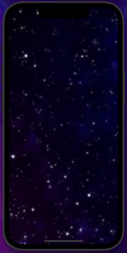
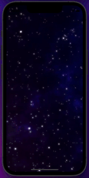
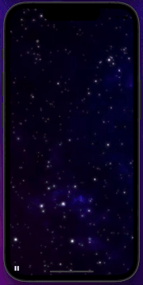

# Video

This is a video component, where we can pass a .mp4 link (as we are doing in the example) and also put it in a file inside the project, just change the VideoType. We can determine if the video will loop, if there will be a play/pause button, if it will start automatically and also.

----------------------------------------------------------------

Este é um componente de vídeo, onde podemos passar um link .mp4 (como estamos fazendo no exemplo) e também por em arquivo dentro do projeto, basta mudar o VideoType. Podemos determinar se o vídeo rodará em loop, se haverá o botão de play/pause, se ele iniciará automaticamente e também

## Getting Started

Clone the repository and run the following commands:
----------------------------------------------------------------
Clone o repositório e execute os seguintes comandos:
```
flutter pub get
flutter run
```

## Screenshots

### Video Component




A few resources to get you started if this is your first Flutter project:
----------------------------------------------------------------
Alguns recursos para você começar se este for seu primeiro projeto Flutter:

- [Lab: Write your first Flutter app](https://flutter.dev/docs/get-started/codelab)
- [Cookbook: Useful Flutter samples](https://flutter.dev/docs/cookbook)


